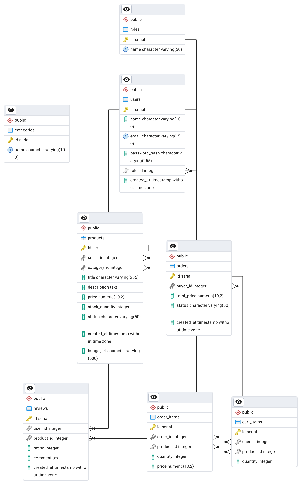

# Meadow Market 🌿

## Live Demo
[Meadow Market on Render](https://meadow-market.onrender.com/)

## Project Description
Meadow Market is a full-stack e-commerce marketplace web application inspired by platforms like Etsy. Independent sellers can list and manage their products, buyers can browse items, add them to a shopping cart, and place orders, and administrators oversee the platform by approving seller products, moderating content, and managing users.

## Database Schema

## User Roles

**Admin**
- Manage users and roles
- Approve or reject seller product listings
- Moderate reviews and site content
- View and manage all orders

**Seller**
- Create, edit, and delete product listings
- Manage inventory
- View and update order statuses for their products

**Buyer**
- Browse products
- Add items to cart
- Checkout and place orders
- View order history
- Leave reviews

## Test Account Credentials
All accounts use the same password.

| Role   | Email                   |
|--------|-------------------------|
| Admin  | admin@meadowmarket.com  |
| Seller | seller@meadowmarket.com |
| Buyer  | buyer@meadowmarket.com  |

## Known Limitations
- No image uploading, product images are added via URL
- No payment processing
- No email notifications for orders
- No search functionality